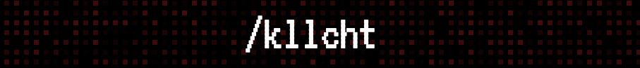
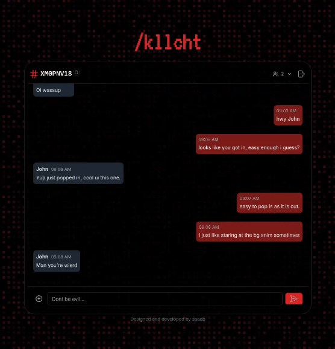

# /kllcht - Disposable Communication Channels
/kllcht is a real-time chat application that lets you create **disposable communication channels**. It's designed with a focus on aesthetics, responsiveness, and seamless user experience. Whether you're creating a new chat room or joining an existing one, /kllcht delivers beautiful design and fluid interactions. Go ahead and try it out [here](https://kill-chat.vercel.app/)

## Features

- **Create & Join Rooms**: Enter your username to create a new room or join an existing one using a chat ID.
- **Real-Time Messaging**: Communicate instantly with others in the room using Socket.IO for real-time messaging.
- **User List**: See all participants in the chat room with a live-updating user list.
- **Disposable Rooms**: Initiate the `/kllcht` sequence to send a system message notifying users that the room will be disposed of soon.
- **Aesthetic Design**: Extra attention has been given to font color, layout, and responsiveness to create a visually striking and enjoyable experience.


<p align="center">
  
</p>

## Tech Stack

- **Frontend**: 
  - [Next.js](https://nextjs.org/)
  - [Tailwind CSS](https://tailwindcss.com/)
- **Backend**:
  - [Express.js](https://expressjs.com/)
  - [Socket.IO](https://socket.io/)
  
## Installation

To get started with /kllcht locally:

1. Clone the repository:
   ```bash
   git clone https://github.com/your-username/kllcht.git

2. Navigate to the project directory:
   ```bash
   cd kllcht

3. Install the dependencies:
   ```bash
   npm install

4. Start the development server:
   ```bash     
   npm run dev

5. In another terminal window, start the backend:
   ```bash
   npm run server

Open http://localhost:3000 in your browser to see the application.

## Usage
Enter your username and create a room or enter a room ID to join an existing room.
Chat with o making it stand out as a "product with a personality."thers in the room, see who’s online, and enjoy the clean, responsive interface.
When you're ready, click the /kllcht button to begin the kill sequence, which sends a message indicating that the chat room will be disposed of soon.

## Future Plans

Here are some features we plan to add to `/kllcht` in the future:

- **Local Persistence**: Save chat history locally to maintain conversations across sessions.
- **Audio Call Functionality**: Allow users to initiate audio calls within the chat room.
- **Screen Share Functionality**: Enable users to share their screens in real-time.
- **Disposable Discord-like Rooms**: Make chat rooms more like disposable Discord rooms, adding flexibility for temporary discussions.

Stay tuned for updates as we continue to improve and expand the features of `/kllcht`!

## Contributing

If you'd like to contribute to the project, feel free to submit a pull request or open an issue for any bugs or suggestions.
